# Backend logic overview

Plain-language summary of what the backend actually does, independent of code
structure. Two processes run independently: a scheduled forecast-and-decision
cycle, and an always-on listener for pump confirmations.

```mermaid
flowchart TD
    subgraph cycle["Every 3 hours: forecast & scheduling cycle"]
        A[Start scheduled check] --> B[Request the latest forecast from all three weather providers, retrying a few times on failure]
        B --> B2{Did a provider still fail after retrying?}
        B2 -->|Yes| B3[Fall back to that provider's last known-good forecast instead of leaving it blank]
        B2 -->|No| C
        B3 --> C
        C[Combine whichever forecasts responded or fell back into one best-estimate outlook]
        C --> D{Is the upcoming temperature forecast at or below freezing?}
        D -->|Yes| E[Pause routine watering as a safety measure; re-check again tomorrow]
        D -->|No| J{Is a watering currently due, on the fixed schedule?}
        J -->|Yes| K[Calculate how much to water, using the freshest forecast for the exact watering moment - can land anywhere from 0% to 100%]
        K --> L[Advance the saved next-watering date to the following cycle, right on schedule]
        J -->|No| M[Keep the previously saved next-watering date as-is]
        E --> N
        L --> N
        M --> N
        N[Snap the watering time to the nearest sunrise or sunset]
        N --> O[Recalculate the amount to water for the upcoming event and the one after it, using the latest forecast]
        O --> O2[Discount the upcoming event's amount by however much rain the airport station actually observed recently]
        O2 --> P[Save the updated schedule, history log, and dashboard status to disk]
        P --> Q[Publish the two upcoming watering events - time and amount - to the pump controller]
    end

    subgraph listener["Always running: pump confirmation listener"]
        R[Pump controller checks in] --> S[Record what the pump actually did - armed, executed, duration]
        S --> T[Save to the confirmation log for the dashboard]
    end
```

## Notes

- **Graceful degradation, with retries first**: each provider gets a few quick
  retry attempts before being treated as down. If it's still unreachable after
  that, its last successfully-fetched forecast is reused (re-windowed to the
  current moment) instead of leaving that provider's chart blank — the
  status indicator still honestly shows it as failed, but the graph keeps
  showing data. Only if a provider has *never* succeeded is there nothing to
  fall back to.
- **The two processes are independent**: the confirmation listener isn't tied to
  the 3-hour cycle — a pump can check in at any time, since it executes a
  watering on its own clock once it has received the scheduled time and amount.
- **The schedule is a fixed timetable, like trains departing on time.** Rain
  and forecast conditions never move the watering date — they only ever
  affect the *amount* commanded for whatever date is already on the books,
  which can legitimately land at 0% (effectively a skip) without touching the
  date itself. The saved next-watering date only ever advances by exactly one
  interval, once its scheduled moment arrives — never recomputed as "now plus
  an interval," so routine 3-hourly checks that find nothing due yet simply
  leave the date untouched.
- **The one exception is a freeze safety-pause**, which isn't a
  weather-driven optimization like rain is — it halts routine watering
  outright and re-checks daily until conditions warm up, rather than
  commanding a 0% event on the fixed date.
- **"Recent rain" comes from the site's airport station (METAR), not the
  forecast providers.** The garden is pinned to any 4-letter ICAO airport
  code entered in the dashboard settings (lat/lon is resolved from that
  station's own METAR, tz reverse-geocoded via Open-Meteo, both cached in
  `data/station_geo_cache.json` after the first lookup); aviationweather.gov's
  METAR feed gives real observed present-weather at that station, not a
  forecast. Since many stations (e.g. Nanjing Lukou ZSNJ, Shanghai Hongqiao
  ZSSS) don't report US-style precipitation totals, each observation's
  present-weather code (e.g. light/moderate/heavy rain) is converted to an
  approximate mm/hour rate and integrated over the time until the next
  observation — a real-but-approximate reading, not a proxy built from a
  forecast being asked about the past. Only rain from roughly the last day
  counts — older observations age out.
